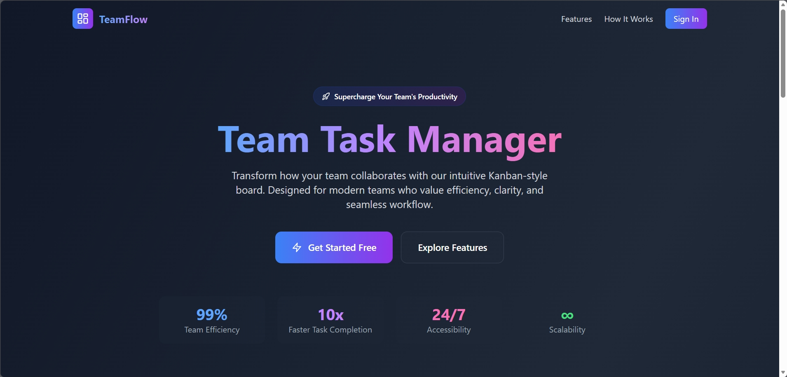

# EVIDENCE

Drop screenshots/logs here, named so a grader knows what each proves:

- `nodes-ready.png` — multi-node `kubectl get nodes`
- `pods-spread.png` — replicas on different nodes (`-o wide`)
- `tls-valid.png` — valid cert (curl -vI / SSL Labs)
- `pvc-persist.log` — data survives a Pod kill
- `zero-downtime.log` — unbroken 200s during a rollout
- `hpa-scale.png` — replicas climbing under load
- `argocd-synced.png` — Argo CD Synced + Healthy
- `failover.png` — app up after a node drain
## Live Application

The application is publicly accessible at:

https://5fty3.name.ng

### Live URL Screenshot

